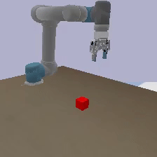
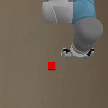
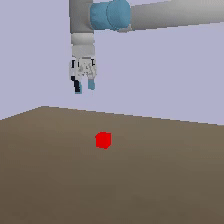

# UR5 SmolVLA Pick-Cube Project

[]()
[]()
[]()
[]()
[](https://huggingface.co/kyle0101/ur5-smolvla-pick-cube-project)

<p align="center">
  
</p>

## Multi-View Observations

<p align="center">
  
  
  
</p>

**Top:** Human-facing PyBullet view used for visualization.

**Bottom:** Three RGB observation cameras used for dataset collection and SmolVLA policy inference.

A Vision-Language-Action (VLA) robotic manipulation project built with **PyBullet**, **LeRobot**, and **SmolVLA**.

This project simulates a **UR5 robotic arm equipped with a Robotiq 85 gripper**, collects expert demonstrations, trains a **SmolVLA policy**, and evaluates language-conditioned pick-and-lift tasks on a red cube.

---

# Hugging Face Repository

Pretrained model and dataset are available on Hugging Face:

🤗 **Model & Dataset**

Pretrained model and dataset are hosted on Hugging Face:

https://huggingface.co/kyle0101/ur5-smolvla-pick-cube-project

Repository contents:

```text
model.safetensors
config.json
policy_preprocessor.json
policy_postprocessor.json
train_config.json
lerobot_dataset/
```

The model can be loaded directly using:

```python
from lerobot.policies.smolvla.modeling_smolvla import SmolVLAPolicy

policy = SmolVLAPolicy.from_pretrained(
    "kyle0101/ur5-smolvla-pick-cube-project"
)
```

---

# Features

* UR5 + Robotiq 85 simulation in PyBullet
* Three RGB observation cameras
* Automatic expert demonstration generation
* LeRobot dataset export
* SmolVLA training pipeline
* Language-conditioned manipulation
* Safe action filtering during inference
* Multi-task evaluation
* Hugging Face model hosting

---

# System Pipeline

```text
PyBullet Environment
        │
        ▼
Expert Demonstrations
        │
        ▼
LeRobot Dataset
        │
        ▼
SmolVLA Training
        │
        ▼
Policy Checkpoint
        │
        ▼
Language-conditioned Inference
        │
        ▼
Task Evaluation
```

---

# Demo

The robot learns to:

* Approach the cube
* Grasp the cube
* Lift the cube
* Follow language instructions

Example tasks:

```text
pick up the red cube
grasp the red cube
lift the red block
pick up the object on the table
```

---

# Project Structure

```text
ur5_vla_project/
│
├── README.md
├── requirements.txt
│
├── ur5_smolvla_env.py
├── inference_smolvla.py
│
├── docs/
│   └── demo.gif
│
├── urdf/
│   ├── ur5_robotiq_85.urdf
│   └── cube_small.urdf
│
├── meshes/
│   ├── ur5/
│   └── robotiq_85/
│
├── lerobot_dataset/
│   └── .gitkeep
│
├── outputs1/
│   └── .gitkeep
│
├── task_eval_results.csv
└── task_eval_results_summary.csv
```

---

# Requirements

## Python

```text
Python 3.10
```

## Main Dependencies

```text
PyBullet
LeRobot
SmolVLA
PyTorch
Transformers
```

---

# Installation

## Create Virtual Environment

```powershell
python -m venv .venv

.\.venv\Scripts\Activate.ps1
```

## Upgrade Pip

```powershell
python -m pip install --upgrade pip
```

## Install PyTorch (CUDA 12.8)

```powershell
pip install torch torchvision torchaudio --index-url https://download.pytorch.org/whl/cu128
```

## Install Dependencies

```powershell
pip install -r requirements.txt
```

---

# Preview Environment

Launch the simulation environment:

```powershell
python ur5_smolvla_env.py --preview
```

The preview displays:

* UR5 robot arm
* Robotiq 85 gripper
* Red cube
* Workspace table
* Fixed observation view

---

# Dataset Collection

Generate expert demonstrations:

```powershell
python ur5_smolvla_env.py ^
  --episodes 100 ^
  --repo-id local/ur5_pick_red_cube_3cam
```

Headless collection:

```powershell
python ur5_smolvla_env.py ^
  --episodes 100 ^
  --repo-id local/ur5_pick_red_cube_3cam ^
  --no-gui
```

Generated dataset:

```text
lerobot_dataset/
```

---

# Dataset Format

## RGB Observations

```text
observation.images.camera1
observation.images.camera2
observation.images.camera3
```

Resolution:

```text
224 × 224 × 3
```

---

## Robot State

```text
observation.state
```

Shape:

```text
(7,)
```

Contents:

```text
joint_0
joint_1
joint_2
joint_3
joint_4
joint_5
gripper
```

---

## Action Space

Shape:

```text
(7,)
```

Contents:

```text
dx
dy
dz
droll
dpitch
dyaw
gripper
```

---

## Language Instructions

Examples:

```text
pick up the red cube
grasp the red cube
lift the red block
```

---

# Train SmolVLA

Train a policy using collected demonstrations:

```bash
lerobot-train \
  --dataset.repo_id=local/ur5_pick_red_cube_3cam \
  --dataset.root=lerobot_dataset \
  --policy.path=lerobot/smolvla_base \
  --output_dir=outputs1/train/smolvla_ur5_pick_cube \
  --job_name=smolvla_ur5_pick_cube \
  --policy.device=cuda \
  --policy.push_to_hub=false \
  --steps=30000 \
  --batch_size=32
```

Generated checkpoints:

```text
outputs1/
```

---

# Run Inference

Configure paths inside:

### Option 1: Local Files

```python
POLICY_PATH = "outputs1/train/smolvla_ur5_pick_cube/checkpoints/last/pretrained_model"

DATASET_REPO_ID = "local/ur5_pick_red_cube_3cam"

DATASET_ROOT = "./lerobot_dataset"
```

### Option 2: Hugging Face Repository

```python
POLICY_PATH = "kyle0101/ur5-smolvla-pick-cube-project"

DATASET_REPO_ID = "local/ur5_pick_red_cube_3cam"

DATASET_ROOT = "./lerobot_dataset"
```

Run evaluation:

```powershell
python inference_smolvla.py
```

---

# Evaluation Tasks

```python
TEST_TASKS = [
    "pick up the object on the table",
    "pick red object",
    "pick up the cube for me",
    "lift the red block",
    "pick up the red cube with the gripper",
]
```

---

# Success Criterion

A task is considered successful when:

```text
cube_height > 0.72 m
```

meaning the cube has been lifted above the predefined threshold.

---

# Safety Constraints

### Maximum Motion Per Step

```python
MAX_DELTA_POS = 0.02
```

### Minimum End-Effector Height

```python
MIN_EE_Z = 0.775
```

### Gripper Range

```python
0.0 ~ 0.085
```

These constraints help prevent collisions and unstable actions during inference.

---

# Evaluation Results

Episode-level results:

```text
task_eval_results.csv
```

Summary statistics:

```text
task_eval_results_summary.csv
```

Metrics:

```text
success
success_rate
running_success_rate
```

---

# Dataset and Checkpoints

Due to GitHub storage limitations, datasets and trained checkpoints are not stored in this repository.

Please download them from:

https://huggingface.co/kyle0101/ur5-smolvla-pick-cube-project

---

# Future Work

* Multi-object manipulation
* Pick-and-place tasks
* Real-world UR5 deployment
* Multi-camera fusion
* Larger training datasets
* More complex language instructions

---

# Acknowledgements

This project is built with:

* PyBullet
* LeRobot
* SmolVLA
* Hugging Face
* UR5 Robot
* Robotiq 85 Gripper

---

# Citation

```bibtex
@misc{ur5_smolvla_pick_cube,
  title={UR5 SmolVLA Pick-Cube Project},
  author={Li Rui-Kai},
  year={2026},
  publisher={GitHub},
  url={https://github.com/your-github-repository}
}
```

---

# License

This project is intended for educational and research purposes.
